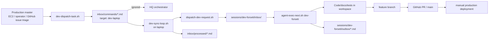
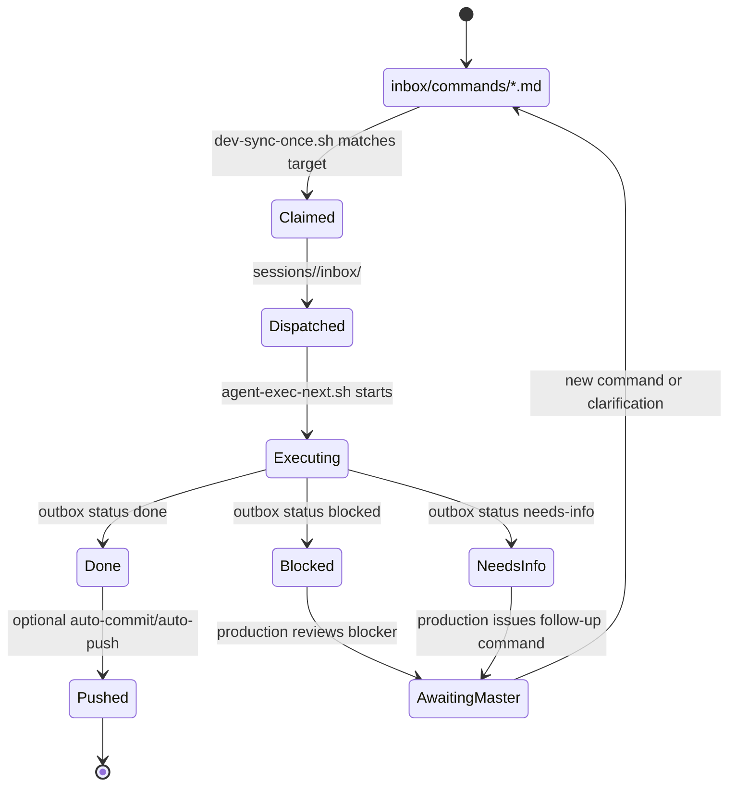
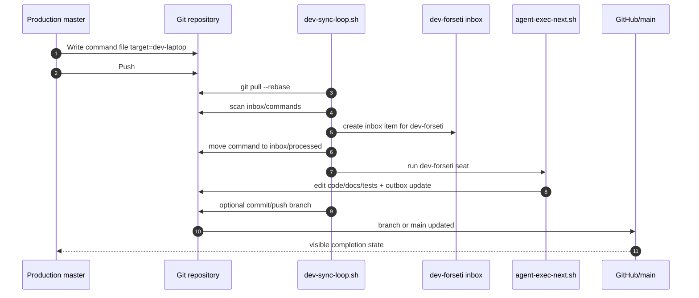

# Production Master → Dev Worker Protocol

## Purpose

This runbook defines the control-plane relationship where production is the
master and the local development laptop is the worker node.

In your terminology, this is the **master/slave** relationship. In the
implementation below, the safer operational terms are:

- **master** = production control plane
- **worker** = local development laptop

The goal is to let production decide what should be worked next, send that work
to the laptop in a durable way, and receive completion state back through the
same repository and Git history.

Primary initial target:

- `job_hunter` work routed to `dev-forseti`

## Design goals

- Production remains authoritative for priority and sequencing.
- The laptop never invents priority; it only executes assigned work.
- Work assignment is durable, auditable, and git-backed.
- Commands survive restarts on both sides.
- The protocol works with the existing HQ inbox/session model.
- JobHunter work can be dispatched without changing the Drupal module itself.

## Non-goals

- Replacing GitHub Issues as planning input.
- Replacing the existing HQ orchestrator for HQ-targeted work.
- Auto-deploying every laptop change to production.
- Letting the laptop become an independent source of backlog truth.

## Control-plane components

| Component | Role | Current implementation point |
|---|---|---|
| Production master | Creates and prioritizes commands | `copilot-hq/scripts/dev-dispatch-task.sh` |
| Shared message bus | Durable queue of commands | `copilot-hq/inbox/commands/` |
| HQ orchestrator | Processes HQ-targeted commands only | `copilot-hq/orchestrator/run.py` |
| Dev worker dispatcher | Claims laptop-targeted commands | `copilot-hq/scripts/dev-sync-once.sh` |
| Dev worker loop | Polls + dispatches + optionally executes | `copilot-hq/scripts/dev-sync-loop.sh` |
| Agent executor | Runs the assigned seat | `copilot-hq/scripts/agent-exec-next.sh` |
| Dev inbox | Local claimed work | `copilot-hq/sessions/dev-forseti/inbox/` |
| Processed ledger | Claimed/consumed commands | `copilot-hq/inbox/processed/` |
| Feature registry | Canonical feature/work-item description | `copilot-hq/features/` |

## Message protocol

Commands remain markdown files in `inbox/commands/` using the existing list
field format.

### Required fields

```md
- created_at: 2026-04-19T12:00:00Z
- source_env: production-master
- target: dev-laptop
- target_agent: dev-forseti
- work_item: forseti-dev-master-worker-sync
- topic: jobhunter-master-worker-sync
```

### Strongly recommended fields

```md
- website: forseti.life
- module: job_hunter
- branch: local/jobhunter-20260419-master-worker-sync
- issue_url: https://github.com/<org>/<repo>/issues/123
- execute: now
- roi: 35
```

### Command body

```md
## Command text
<human-readable work order from production>

## Acceptance hints
<optional constraints, validation notes, links>
```

## Routing rules

### Rule 1 — HQ orchestrator owns HQ targets only

If `target` is missing, `hq`, `orchestrator`, or `ceo`, the normal HQ
orchestrator may process the command.

### Rule 2 — Dev worker owns laptop targets

If `target: dev-laptop`, the HQ orchestrator must leave the file alone. The
laptop claims it via `dev-sync-once.sh`.

### Rule 3 — Claimed command is converted into a normal agent inbox item

The worker creates a folder in `sessions/<target_agent>/inbox/` and writes:

- `command.md`
- `README.md`
- `00-problem-statement.md`
- `01-acceptance-criteria.md`
- `06-risk-assessment.md`
- `roi.txt`

That keeps execution compatible with `agent-exec-next.sh`.

## CEO project-based delegation

CEO should dispatch by project id/alias using:

```bash
./scripts/ceo-dispatch-project-task.sh \
  <project-id-or-alias> \
  <work-item-id> \
  <short-topic> \
  "<command text>"
```

Dispatch resolution flow:

1. Resolve project alias from `org-chart/products/product-teams.json`
2. Load target node + seat from `dashboards/PROJECTS.md` → `Development Node Assignment Registry`
3. Emit command envelope with `target`, `target_agent`, `website`, and `module`
4. Worker node claims and dispatches to the resolved seat inbox

## End-to-end topology



## Command lifecycle



## Sequence: production assigns JobHunter work to laptop



## Git protocol

The repository remains the durable transport.

### Pull policy on laptop

Before claiming work:

1. ensure workspace is clean unless dirty state is explicitly allowed
2. `git pull --rebase`
3. scan for `target: dev-laptop`

### Branch policy

- If the command provides `branch`, the laptop should use it for implementation.
- If no branch is provided, create:
  - `local/<module>-<YYYYMMDD>-<topic>`

### Push policy

- Safe default: auto-push disabled until trust is established.
- Mature mode: enable `DEV_SYNC_AUTO_COMMIT=1` and `DEV_SYNC_AUTO_PUSH=1` on the laptop.
- Production remains master because it controls command creation and promotion.

## Protocol for blockers

If execution returns:

- `Status: blocked`
- `Status: needs-info`

then production remains the decision-maker. The worker does not self-prioritize.

Recommended pattern:

1. Laptop writes outbox result.
2. Production reviews outbox and code diff.
3. Production issues follow-up command if needed.

## JobHunter-first operating mode

For the initial rollout, standardize these defaults:

| Field | Default |
|---|---|
| `target` | `dev-laptop` |
| `target_agent` | `dev-forseti` |
| `website` | `forseti.life` |
| `module` | `job_hunter` |
| `execute` | `now` |

This makes production-generated JobHunter tasks routable with no extra manual
mapping on the laptop.

## Failure handling

### If production is down

- Commands stop being created.
- Laptop finishes already claimed work only.
- No new priority decisions originate from laptop.

### If laptop is down

- Commands remain durable in `inbox/commands/`.
- HQ orchestrator leaves `target: dev-laptop` untouched.
- Work resumes after laptop restart.

### If a command is malformed

- Worker sends it to `inbox/processed/` only after converting it into a clear
  local inbox item or rejecting it with a visible error.
- Missing `target_agent` falls back to `dev-forseti`.
- Missing `topic` falls back to the filename stem.

### If git workspace is dirty

- Worker should refuse auto-pull unless `DEV_SYNC_ALLOW_DIRTY=1`.
- This avoids overwriting uncommitted local work.

## Security / safety guardrails

- Do not place secrets in command files.
- Use issue URLs, work item IDs, and repo paths, not credentials.
- The worker loop should only process explicit `target: dev-laptop` commands.
- Production promotion stays manual.

## Initial implementation phases

### Phase 1 — implemented locally now

- targeted command schema
- production dispatch script
- laptop dispatch script
- laptop sync once/loop scripts
- systemd user service for laptop worker loop
- HQ orchestrator skip logic for laptop-targeted commands

## Local bring-up and smoke test

Install persistent systemd user services (recommended):

```bash
cd /home/keithaumiller/forseti.life/copilot-hq
./scripts/install-systemd-master-node.sh
./scripts/install-systemd-dev-sync.sh
```

Manual start local node loops (alternative):

```bash
cd /home/keithaumiller/forseti.life/copilot-hq
./scripts/orchestrator-loop.sh start 60
./scripts/dev-sync-loop.sh start 300
```

Check status:

```bash
./scripts/orchestrator-loop.sh status
./scripts/dev-sync-loop.sh status
systemctl --user --no-pager status copilot-sessions-hq-master-node.service | sed -n '1,16p'
systemctl --user --no-pager status copilot-sessions-hq-dev-sync.service | sed -n '1,16p'
```

Run one-command delegation smoke test (master node to worker node):

```bash
./scripts/local-master-worker-smoke.sh
```

Run release-cycle verification (logic + tests + health diagnostics):

```bash
./scripts/verify-local-release-cycle.sh
```

Expected result:

- `PASS`
- command file moved to `inbox/processed/`
- new worker inbox folder under `sessions/dev-forseti/inbox/`

### Phase 2 — next

- GitHub Issue label automation (`dev-task`, `jobhunter`, `ready-for-laptop`)
- automatic command generation from issue metadata
- dashboard panel for laptop queue depth and last poll time
- auto-comment on issue when laptop claims/completes a task

### Phase 3 — hardening

- signed command provenance
- explicit ACK/NACK state files
- retry policy and command lease timeout
- optional QA-seat dispatch on laptop for local verification loops

## Implementation checklist

- [x] Document protocol and routing rules
- [x] Add targeted command dispatch script
- [x] Add laptop sync scripts
- [x] Add systemd service installer
- [x] Prevent HQ orchestrator from stealing laptop-targeted work
- [ ] Add GitHub issue automation
- [ ] Add dashboard/telemetry for worker state
- [ ] Add issue comment reconciliation
