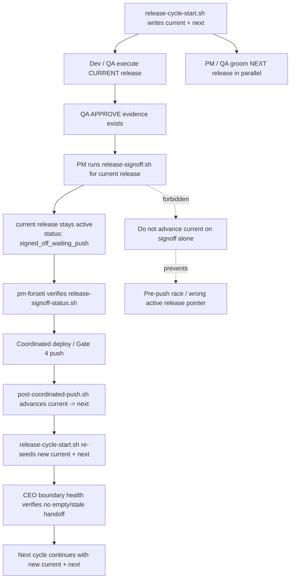

# Release Cycle — Master Process Flow (with handoffs + sources of truth)

This runbook is the **single, master description** of the HQ release cycle and its handoffs.

- System of record for work execution: **HQ `sessions/` (inbox → outbox → artifacts)**
- System of record for coordination gates: **release candidate artifacts + PM signoffs**
- System of record for visibility: **Drupal dashboards (copilot_agent_tracker)**

## Glossary

- **Seat / agent**: an org role instance, mapped to an HQ folder under `sessions/<agent_id>/...`.
- **Work item**: a directory under `sessions/<agent_id>/inbox/<item_id>/`.
- **Outbox update**: a markdown file under `sessions/<agent_id>/outbox/<item_id>.md`.
- **Artifacts**: durable attachments / archived work items under `sessions/<agent_id>/artifacts/`.
- **Release id**: a human-chosen identifier used across artifacts and signoffs (e.g. `20260224-coordinated-release`).

## Dual-release model (permanent operating mode)

The org **always** has two releases defined simultaneously:

| Track | Who owns it | What happens |
|-------|-------------|---------------|
| **Current release** | Dev + QA | Executing (Stage 3–7). Scope is frozen. |
| **Next release** | PM + QA | Grooming backlog: intake → triage → AC → test plans. |

When the current release ships (Stage 7 complete), next becomes current, and a new next is immediately defined.
`release-cycle-start.sh` requires both IDs: `<site> <current-release-id> <next-release-id>`.
Both are tracked in `tmp/release-cycle-active/`.

**The orchestrator manages this automatically.** The `release_cycle` step (runs every 5 min) starts
missing cycles and keeps `next_release_id` aligned with the active release. **It does not advance
`current release_id` on PM signoff alone.** Runtime advancement happens only after the coordinated push
handoff completes via `scripts/post-coordinated-push.sh`. That handoff now immediately re-runs
`release-cycle-start.sh` for the new current/next pair and runs `scripts/ceo-release-boundary-health.sh`
so the next cycle is seeded without waiting for the periodic CEO loop.
See `runbooks/orchestration.md` for the full trigger path.

## Release handoff diagram (authoritative)



**Rule:** PM signoff means **ready to push**. Only `post-coordinated-push.sh` may move the runtime
pointer to the next release.

## Release cycle principles (policy)

- A release cycle is **not daily**. It lasts as long (or short) as needed to ship a stable product.
- Once a release cycle starts (release id created and scope committed), the release is **scope-frozen**.
  - **No net-new scope may be added to the in-flight release.**
  - New intake is always queued to the **next release** (never the current). PM works next-release grooming in parallel with Dev execution.
  - Stabilization work is allowed **only** when it is required to satisfy already in-scope acceptance criteria (e.g., QA finds a release-blocking defect in a scoped change). These items must be recorded as "stabilization" under the existing scope, not treated as new feature intake.
- PM owns the scoped release content:
  - PM curates the list of features/defects shipping in the release.
  - The canonical list is the release candidate’s `01-change-list.md`.
- QA owns test-case design and the verification protocol:
  - PM hands release scope to QA.
  - QA produces/updates the test plan and ensures coverage for every release-bound change.
- QA does not dispatch inbox items for other roles.
- Dev consumes failing suite evidence directly; PM is pulled in only for scope/intent decisions and for final ship.
- Test-case source of truth requirement:
  - **All product test cases must live in a single central source of truth that is executable automation with PASS/FAIL outcomes.**
  - The release candidate must record the automated suites run and their results.

## QA regression cadence policy (authoritative)

Full regression is executed at exactly three checkpoints:
1) Start-of-cycle baseline regression (after release id + scope freeze).
2) Final pre-ship regression (after last Dev repair in the cycle).
3) Post-release production regression.

Between those checkpoints, QA runs incremental targeted verification only:
- defect-level retests,
- enhancement-specific verification,
- function/unit-scope checks tied to the changed behavior.

Continuous full-site regression loops are not the default release-mode behavior.

## Sources of truth (SoT)

This section is intentionally explicit: if two things disagree, the SoT below wins.

### Org automation + convergence

- Org on/off switch: `tmp/org-control.json`
- Control command: `scripts/org-control.sh`
- Read-only gate check: `scripts/is-org-enabled.sh`
- Convergence/watchdog: `scripts/hq-automation.sh`, `scripts/hq-automation-watchdog.sh`
- Status/observability: `scripts/hq-status.sh`

### Release-cycle automation control

- Release-cycle on/off switch: `/var/tmp/copilot-sessions-hq/release-cycle-control.json` (legacy fallback: `tmp/release-cycle-control.json`)
- Control command: `scripts/release-cycle-control.sh`
- Read-only gate check: `scripts/is-release-cycle-enabled.sh`
- Pause effect: orchestrator skips `release_cycle`, coordinated-push release automation, and health-check release dispatchers while the rest of HQ remains enabled

### Seat configuration + scope

- Configured seats list + roles: `org-chart/agents/agents.yaml`
- Product team registry (release + QA automation wiring): `org-chart/products/product-teams.json`
- Org-wide policy: `org-chart/org-wide.instructions.md`
- Role instructions: `org-chart/roles/<role>.instructions.md`
- Per-seat instructions: `org-chart/agents/instructions/<agent_id>.instructions.md`
- Site-specific scope/instructions:
  - `org-chart/sites/forseti.life/site.instructions.md`
  - `org-chart/sites/dungeoncrawler/site.instructions.md`

### Execution work queue

- Per-seat inbox queue: `sessions/<agent_id>/inbox/<item_id>/`
  - Input payload: `command.md` (plus optional `README.md`, `00-problem-statement.md`, etc.)
  - Priority: `roi.txt`
- Per-seat outbox: `sessions/<agent_id>/outbox/<item_id>.md`
- Archived items + attachments: `sessions/<agent_id>/artifacts/`

### Release coordination artifacts

- Release candidate folder (canonical):
  - `sessions/<lead_pm>/artifacts/release-candidates/<YYYYMMDD-release-id>/`
  - Template SoT: `templates/release/*`
  - Release-notes quality gate: `scripts/release-notes-lint.sh`
- Release scope (canonical):
  - `sessions/<lead_pm>/artifacts/release-candidates/<YYYYMMDD-release-id>/01-change-list.md`
- PM signoff SoT:
  - `sessions/<pm-seat>/artifacts/release-signoffs/<release-id-slug>.md`
  - Required PM seats are resolved from `org-chart/products/product-teams.json` where `active=true` and `coordinated_release_default=true`.
  - Commands:
    - `scripts/release-signoff.sh <site-or-team-alias> <release-id>`
    - `scripts/release-signoff-status.sh <release-id>`
    - `scripts/release-notes-lint.sh <release-candidate-dir|release-notes-file>`

### QA configuration + evidence

- Site permission expectations (canonical):
  - `org-chart/sites/forseti.life/qa-permissions.json`
  - `org-chart/sites/dungeoncrawler/qa-permissions.json`
- Scripted QA runner (canonical): `scripts/site-audit-run.sh`
- QA artifacts (script output SoT):
  - `sessions/qa-*/artifacts/auto-site-audit/<ts>/...`
  - Key evidence files:
    - `<label>-crawl.json` (+ md/csv)
    - `<label>-custom-routes.json`
    - `permissions-validation.json` / `permissions-validation.md`
    - `route-audit-summary.md`
- Verification report template SoT: `templates/04-verification-report.md`

Central test-case references:
- Per-product automated suite manifests (SoT):
  - `qa-suites/products/<product>/suite.json`
  - Product↔suite mapping SoT: `org-chart/products/product-teams.json` (`qa_suite_manifest`)
- Dungeoncrawler (PHPUnit + Playwright): `../forseti.life/sites/dungeoncrawler/web/modules/custom/dungeoncrawler_tester/TESTING.md`
- Jobhunter domain flow reference (workflow spec, not pass/fail automation by itself): `sessions/shared-context/forseti-jobhunter/PROCESS_FLOW.md`

Policy reminder:
- `templates/03-test-plan.md` is a planning artifact.
- The **canonical test cases** are the product’s executable automation suites (PASS/FAIL). If a product does not yet have a documented suite location + runner, creating that is release work.

### Visibility layer (Drupal)

The dashboards mirror HQ state; they are not the execution source of truth.

- Drupal module: `../forseti.life/sites/forseti/web/modules/custom/copilot_agent_tracker/`
- Primary dashboard surface:
  - `/admin/reports/waitingonkeith`
- Canonical Drupal tables (storage):
  - `copilot_agent_tracker_agents` (one row per seat)
  - `copilot_agent_tracker_events` (append-only event stream)

HQ → Drupal publisher:
- `scripts/publish-forseti-agent-tracker.sh`

## High-level flow diagram

```mermaid
flowchart TD
  A[Backlog intake normalized to features/<work-item>/feature.md] --> B[Stage 0: release-id + scope freeze]
  B --> C[QA updates suite manifest + runs full regression]
  C --> D{All required suites PASS?}

  D -- Yes --> E[Release candidate evidence updated (02-test-evidence.md)]
  E --> F[PM signoff(s) recorded (if coordinated)]
  F --> G[PM ships]
  G --> H[Post-release QA (production) regression]
  H --> I{Post-release clean?}

  D -- No --> J[QA notifies Dev: begin fixes]
  J --> K[Dev applies fix for failed test]
  K --> L[Dev notifies QA]
  L --> M[QA functionally verifies + updates PASS/FAIL tracker]
  M --> N{Attempt count for this failure >= 5?}
  N -- No --> C
  N -- Yes --> O[Escalate to PM decision: accept risk | pull feature | re-baseline]
  O --> C

  I -- Yes --> P[Start next release cycle]
  I -- No --> Q[Next release scope: remediation-only (no new features)]
  Q --> P
```

## Release cycle stages (detailed)

### Stage 0 — Start of cycle (release id established)

**Owner:** Release coordinator (default `pm-forseti`) + QA seats

**Handoff:** create a release id, define/freeze scope from the **already-groomed backlog**, and begin populating the release candidate folder.

**Rule: only groomed items enter the release.** A feature is groomed when all three of these exist:
- `features/<id>/feature.md` (brief + mission alignment)
- `features/<id>/01-acceptance-criteria.md` (complete — not a stub)
- `features/<id>/03-test-plan.md` (QA test cases written + added to `suite.json`)

If any of the three is missing, the feature is **not eligible for this release**. It goes into the next cycle's grooming queue. This is non-negotiable — ungroomed items hold up verification and will be cut.

#### Stage 0 SoT: groomed backlog (ready-for-dev items)

Goal: PM selects scope exclusively from features that have passed the grooming gate above.

Sources of truth:
- Canonical groomed backlog: `features/<work-item-id>/` with all three artifacts present
- Release scope: `sessions/<lead_pm>/artifacts/release-candidates/<release-id>/01-change-list.md`

#### Stage 0 SoT: production-escape defects (post-release findings)

Goal: any defect discovered *in production after a release* is captured with evidence and converted into a backlog work item for the next release cycle.

Sources of truth:
- Canonical evidence (what happened): post-release QA artifacts
  - `sessions/qa-*/artifacts/auto-site-audit/<ts>/findings-summary.md`
  - `sessions/qa-*/artifacts/auto-site-audit/<ts>/findings-summary.json`
- Canonical backlog item (what we will do about it): `features/<work-item-id>/feature.md`

Normalization rule:
- Each production-escape defect must result in a work item under `features/` that links to the evidence directory above.
- The work item acceptance criteria must include:
  - the product fix (Dev-owned)
  - and the prevention test (QA-owned): add/adjust automated coverage in `qa-suites/products/<product>/suite.json` so the escape becomes a non-regression PASS/FAIL check.

1) Release cycle startup is **automated** — the orchestrator's `release_cycle` step starts cycles
   without human intervention by calling `scripts/release-cycle-start.sh <team> <current-id> <next-id>`.
   Release IDs are generated as `YYYYMMDD-<team>-release` (current) and `YYYYMMDD-<team>-release-next`.
   To manually start or override a cycle:
   ```bash
   scripts/release-cycle-start.sh <team_id> <current-release-id> <next-release-id>
   # Example:
   scripts/release-cycle-start.sh forseti 20260226-forseti-r1 20260226-forseti-r2
   ```
2) PM selects scope from **groomed-only** backlog (`features/*/03-test-plan.md` must exist).
   Items missing any grooming artifact are automatically deferred to next cycle — do not negotiate.
3) Record scope in `01-change-list.md`. This is the **scope freeze** — no net-new items after this.
   - Stabilization fixes for already in-scope AC are allowed; record under a "stabilization" section.
4) QA preflight is queued automatically by `release-cycle-start.sh` (step 1 above).

**SoT locations:**
- QA preflight work item: `sessions/qa-*/inbox/<YYYYMMDD-release-preflight-test-suite-...>/command.md`
- Release candidate folder: `sessions/<lead_pm>/artifacts/release-candidates/<YYYYMMDD-release-id>/`

### Stage 1 — Intake (backlog; for next cycle once scope is frozen)

**Owner:** Any role (intake), coordinated by PM

**Handoff:** requests become work items in the correct seat inbox.

Release-cycle rule:
- Intake is always allowed, but **intake does not automatically change release scope**.
- If the current release is already started + scope frozen (Stage 0), PM must queue new net-new scope intake for the **next** release cycle (or add it to “Deferred”).
- Stabilization items required to satisfy already in-scope acceptance criteria are allowed in the current cycle; they must be recorded as stabilization (not new scope).

**SoT locations:**
- Work items: `sessions/<agent_id>/inbox/<item_id>/...`
- Input payload: `command.md` (+ optional templates for problem statement, acceptance criteria, etc.)
  - Templates SoT: `templates/00-problem-statement.md`, `templates/01-acceptance-criteria.md`, `templates/06-risk-assessment.md`

### Stage 2 — Triage / routing / dedupe

**Owner:** PM(s) (coordination; tie-breakers resolved by the requesting PM's supervisor if needed)

**Handoff:** items are assigned to the correct seat; duplicates are consolidated.

Delegation rule:
- QA does not generate Dev/PM inbox items.
- Dev fixes failing suites directly based on the evidence.
- PM is pulled in only for scope/intent decisions and risk acceptance.

**SoT locations:**
- Routing reality is by queue placement: `sessions/<agent>/inbox/...`
- Seat scope rules: `org-chart/agents/agents.yaml` + per-seat instructions.

### Stage 3 — Execution (implementation work) + parallel next-release grooming

**Owner:** Dev/Sec/Infra/QA seats (current release) + PM (next-release grooming, runs in parallel)

**Handoff:** for each work item, the executor produces an outbox update and archives the inbox item.

**SoT locations:**
- Executor selection + locking: `scripts/agent-exec-next.sh`
- Output: `sessions/<agent>/outbox/<item_id>.md`
- Archived input: `sessions/<agent>/artifacts/<item_id>/...`

#### Parallel track: PM grooms the next release during Stage 3

While Dev executes the current release, PM works the next release backlog in parallel.
This grooming work **does not touch the current release** — it prepares the queue so the next
Stage 0 is instant: scope selection from a fully-groomed ready list.

**PM grooming work during Stage 3:**

1. **Audit the existing next-release backlog first**:
   - Scan for next-release features already in `planned`, `ready`, or `in_progress` that are missing `01-acceptance-criteria.md` or `03-test-plan.md`
   - Finish those backlog items before treating suggestion intake as complete
2. **Pull community suggestions** (run once at the start of Stage 3):
   ```bash
   ./scripts/suggestion-intake.sh forseti
   ```
3. **Triage** each suggestion (accept/defer/decline/escalate) per `runbooks/feature-intake.md`
  - Security/integrity/stability-risk suggestions must be `escalate`d for human board review (not accepted directly by PM)
4. **Write or complete Acceptance Criteria** for each accepted or already-tracked backlog feature missing `features/<id>/01-acceptance-criteria.md`
5. **Hand off to QA** for test generation (one per accepted/backlog feature that has AC but lacks `03-test-plan.md`):
   ```bash
   ./scripts/pm-qa-handoff.sh forseti <feature-id>
   ```
6. **QA generates test cases** → `qa-suites/products/forseti/suite.json` + `features/<id>/03-test-plan.md`

When all three artifacts exist for a feature (`feature.md` + `01-acceptance-criteria.md` + `03-test-plan.md`), it is **groomed and ready** — it enters the candidate pool for the next Stage 0 scope selection.

**Key rule:** grooming work for the next release runs entirely in parallel and is completely independent
of the current release execution. PM escalations, AC questions, and QA test-generation back-and-forth
for *next* release items must not create inbox items for Dev seats working the *current* release.

### Stage 4 — Verification (QA)

**Owner:** QA seats (`qa-*`)

**Handoff:** QA produces test evidence + a verification report with explicit APPROVE/BLOCK.

Test-case SoT rule (release-bound):
- The canonical test cases are the product’s central automated PASS/FAIL suites.
- `templates/03-test-plan.md` may be used to plan, but the release evidence must include automated suite results.

Handoff to Dev:
- If suites fail, Dev fixes product code (or proposes suite fixes if the test is flawed).
- QA updates suites as needed for new features and keeps `qa-suites/products/<product>/suite.json` current.
- Automated QA→Dev work generation is release-cycle gated:
  - It activates only when a release cycle is active (started via the orchestrator `release_cycle` step or manually via `scripts/release-cycle-start.sh`).
  - Automated Dev items are scoped to: **review QA results and fix failed tests**.

Dev↔QA repair loop (State 2 cycle: until all tests PASS):
1) QA runs the full regression suites for the in-scope release and records PASS/FAIL evidence.
  - Evidence SoT: release candidate `02-test-evidence.md` + QA artifacts (e.g., `findings-summary.md`).
2) QA notifies Dev to begin fixes (Dev does not report to PM during the fix loop).
3) Dev addresses each failed test (product code fix) and notifies QA as each fix is applied.
4) QA functionally verifies each fix (targeted re-run for the affected test/suite) and updates the PASS/FAIL tracker.
5) Escalation rule (risk/scope decision):
  - If a single failing test (or tightly-coupled failure cluster) reaches **5 failed fix attempts**, QA escalates to PM for a decision:
    - accept risk for this release,
    - pull the feature from the release,
    - or re-baseline scope.
6) QA runs targeted retests for changed behavior while fixes are in flight.
7) QA runs the full regression suites once all pending repair items are complete.
8) Repeat until both QA and Dev agree: all required suites are PASS.
9) QA notifies PM of release readiness (PM proceeds to final ship gates).

**SoT locations:**
- QA scripted audits: `scripts/site-audit-run.sh`
- QA artifacts: `sessions/qa-*/artifacts/auto-site-audit/<ts>/...`
- Verification report format SoT: `templates/04-verification-report.md`
- Shipping gate definition: `runbooks/shipping-gates.md`
- PASS/FAIL tracker + fix attempt log SoT (per release): `sessions/<lead_pm>/artifacts/release-candidates/<YYYYMMDD-release-id>/02-test-evidence.md`

### Stage 5 — Release candidate assembly (single folder)

**Owner:** Release coordinator (default `pm-forseti`)

**Handoff:** all readiness evidence is centralized into a single release candidate folder.

**SoT locations:**
- Folder: `sessions/<lead_pm>/artifacts/release-candidates/<YYYYMMDD-release-id>/`
- Required docs (templates SoT: `templates/release/*`):
  - `00-release-plan.md`
  - `01-change-list.md`
  - `02-test-evidence.md`
  - `03-risk-security.md`
  - `04-rollback.md`
  - `05-release-notes.md`
  - Optional: `05-human-approval.md`

### Stage 6 — Coordinated PM signoff

**Owner:** Coordinated-release PM seats (`pm-*`) flagged in product registry

**Handoff:** one signoff artifact exists per required PM seat for the same release id. Release operator proceeds only when all required signoffs exist.

**Important:** Stage 6 does **not** advance `tmp/release-cycle-active/<team>.release_id`. The signed
release remains the active runtime release until Stage 7 push/post-push completes.

**SoT locations:**
- Signoff creation:
  - `scripts/release-signoff.sh <site-or-team-alias> <release-id>`
- Signoff status check:
  - `scripts/release-signoff-status.sh <release-id>`
- Artifact files (canonical):
  - `sessions/<pm-seat>/artifacts/release-signoffs/<slug>.md`

### Stage 7 — Ship

**Owner:** Release operator (default `pm-forseti`)

**Handoff:** the coordinated push happens only after gates are satisfied and signoffs exist.

**Runtime advancement point:** after the coordinated deploy succeeds, run
`scripts/post-coordinated-push.sh`. That is the only step that promotes:
- `current release_id -> previous next_release_id`
- `next_release_id -> newly generated successor`

**SoT locations:**
- Release coordinator runbook: `runbooks/coordinated-release.md`
- Gates runbook: `runbooks/shipping-gates.md`
- Final release notes: `sessions/<lead_pm>/artifacts/release-candidates/<...>/05-release-notes.md`

#### Stage 7 — Close out community suggestions

After code is deployed, PM closes the loop on every community suggestion that originated a shipped feature:

```bash
# For each feature in 01-change-list.md that has a source NID:
./scripts/suggestion-close.sh forseti <nid> <release-id>

# For rejected/pulled features (suggestion not shipped):
./scripts/suggestion-close.sh forseti <nid> <release-id> --declined "Reason pulled"
```

This script:
1. Updates `community_suggestion` Drupal node: `field_suggestion_status → implemented` (or `declined`)
2. Appends a closure message to the **original AI conversation** (`field_conversation_reference`) — the user sees it next time they open the chat
3. Sends an **email** to the original requester (via `uid` on the suggestion node)

The source NID for each feature is recorded in `features/<feature-id>/feature.md` under `Source: community_suggestion NID <nid>`.

### Stage 8 — Post-release QA (production)

**Owner:** QA seats

**Handoff:** QA reruns the same protocol against production (explicitly enabled) and records clean/unclean.

Policy (release-cycle discipline):
- Post-release QA always feeds the next cycle.
- If post-release is **unclean**, the next release cycle scope is **remediation-only**:
  - fix the escaped-to-production defects
  - fix/improve the automated suites so these escapes become non-regressions
  - **no new features** in the next release
- PM escalation rule:
  - If there are **3 unclean releases in a row** for a product/site, PM escalates to Board for intervention.

**SoT locations:**
- Command examples + rules: `runbooks/role-based-url-audit.md`
- Production gating env var: `ALLOW_PROD_QA=1`
- Artifacts: `sessions/qa-*/artifacts/auto-site-audit/<ts>/...`
- Rolling release health SoT (per product/site): `knowledgebase/scoreboards/<site>.md` (tracks escaped defects + consecutive unclean releases)

#### CEO quality check — project progression audit (required)

After post-release QA is recorded, the CEO must confirm the active portfolio is still progressing, not just that the release shipped cleanly.

**Command:**
```bash
python3 scripts/project-progress-audit.py
```

**Policy:**
- Every active `PROJ-*` entry in `dashboards/PROJECTS.md` must record:
  - `Last scoped release`
  - `Progress SLA`
  - `Next step`
  - `Queue status`
- Default progression SLA: **7 days**
- A project is in breach when more than 7 days pass without either:
  - a release containing project-scoped work, or
  - a PM-owned re-baseline/grooming update that is reflected in the roadmap and queue
- PMs are responsible for grooming the next slice and keeping `Next step` / `Queue status` current even when a project is between scoped releases.

**CEO action on breach:**
1. Dispatch a PM inbox item the same session.
2. Update `dashboards/PROJECTS.md` so the roadmap shows the real state.
3. Do not close the release-management loop while active projects have silent drift.

### Stage 9 — Continuous improvement (carry lessons forward)

**Owner:** PM seats

**Handoff:** after release completion, PM runs a post-release process review, records gaps, and queues follow-through items to owning seats.

**SoT locations:**
- Lessons/proposals: `knowledgebase/lessons/`, `knowledgebase/proposals/`
- Org-wide/role/seat instructions: `org-chart/*`
- Post-release PM process review dispatch: `scripts/improvement-round.sh` (and associated queues)

## Cross-runbook references

- Coordination + thresholds: `runbooks/coordinated-release.md`
- Gate definitions: `runbooks/shipping-gates.md`
- Orchestration overview: `runbooks/orchestration.md`
- Session monitoring: `runbooks/session-monitoring.md`
- QA methodology: `runbooks/role-based-url-audit.md`
